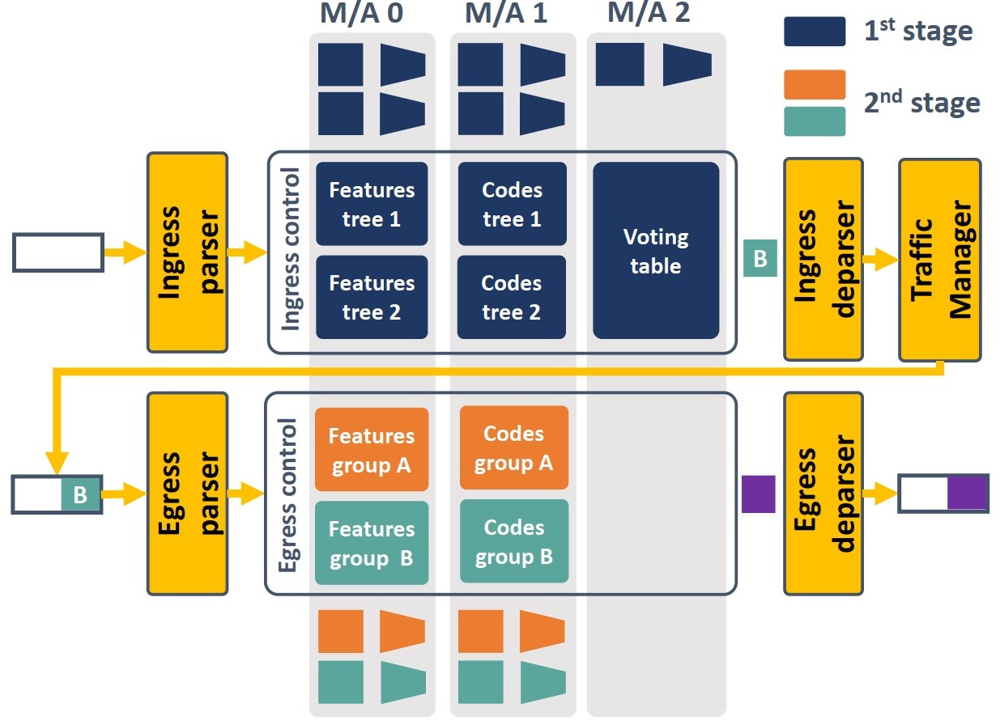

# Henna: Hierarchical Machine Learning Inference in Programmable Switches  

This repository contains the public version of the code for our work Henna, presented at the 1st ACM CONEXT Workshop on Native Network Intelligence (_NativeNI '22_), 9 December 2022, Roma, Italy.

## Henna two-stage architecture 
  

Henna is an in-switch implementation of a hierarchical classification system. The concept underpinning our solution is that of splitting a difficult classification task into easier cascaded decisions, which can then be addressed with separated and resource-efficient tree-based classifiers. We propose a design of Henna that aligns with the internal organization of the Protocol Independent Switch Architecture (PISA), and integrates state-of-the-art strategies for mapping decision trees to switch hardware. We then implement Henna into a real testbed with off-the-shelf Intel Tofino programmable switches using the P4 language.  


For more details, please consult our paper: https://doi.org/10.1145/3565009.3569520

## Organization of the repository  
There are three folders:  
- _Data_: information on how to access the data 
- _P4_: the P4 code for Tofino and the M/A table entries
- _Python_: the jupyter notebooks for training the machine learning models, and the python scripts for generating the M/A table entries from the saved trained models.

## Use case
The use case considered in the paper is an IoT device identification task based on the publicly available UNSW-IOT Traces which you can find at https://iotanalytics.unsw.edu.au/iottraces.html. Fifteen days of data are used for model training and one day is used for testing.

## Citation
If you make use of this code, kindly cite our paper:  
```
@inproceedings{henna-2022,
author = {Akem, Aristide Tanyi-Jong and Bütün, Beyza and Gucciardo, Michele and Fiore, Marco},
title = {Henna: Hierarchical Machine Learning Inference in Programmable Switches},
year = {2022},
publisher = {Association for Computing Machinery},
address = {New York, NY, USA},
url = {https://doi.org/10.1145/3565009.3569520},
doi = {10.1145/3565009.3569520},
booktitle = {Proceedings of the 1st Workshop on Native Network Intelligence},
numpages = {7},
location = {Roma, Italy},
series = {NativeNI '22}
}
```
<!-- Aristide Tanyi-Jong Akem, Beyza Bütün, Michele Gucciardo, and Marco Fiore. 2022.  
Henna: Hierarchical Machine Learning Inference in Programmable Switches.  
_In Native Network Intelligence (NativeNI ’22), December 9, 2022, Roma, Italy_.  
ACM, New York, NY, USA, 7 pages. https://doi.org/10.1145/3565009.3569520   -->

If you need any additional information, send us an email at aristide.akem@imdea.org


